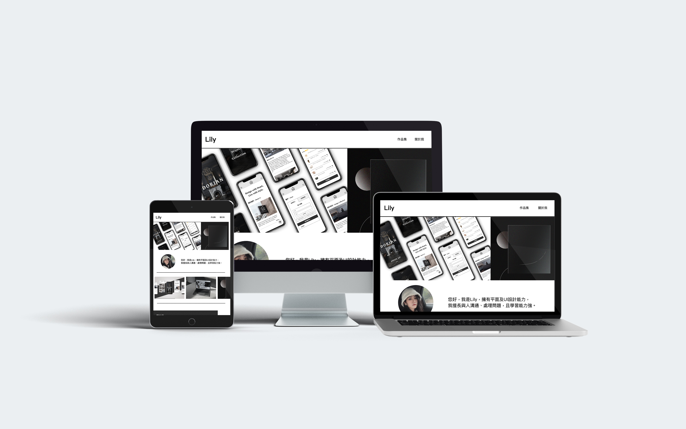
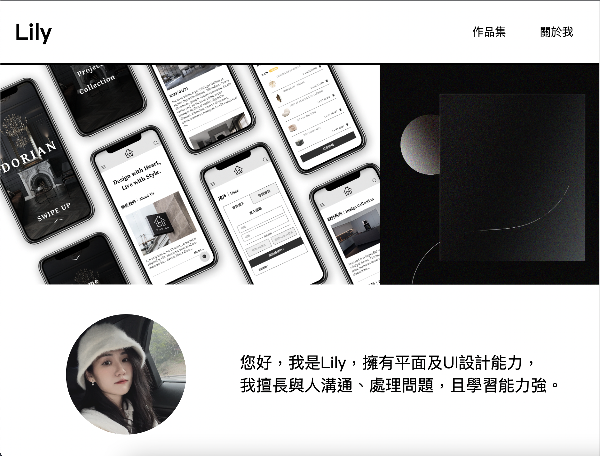
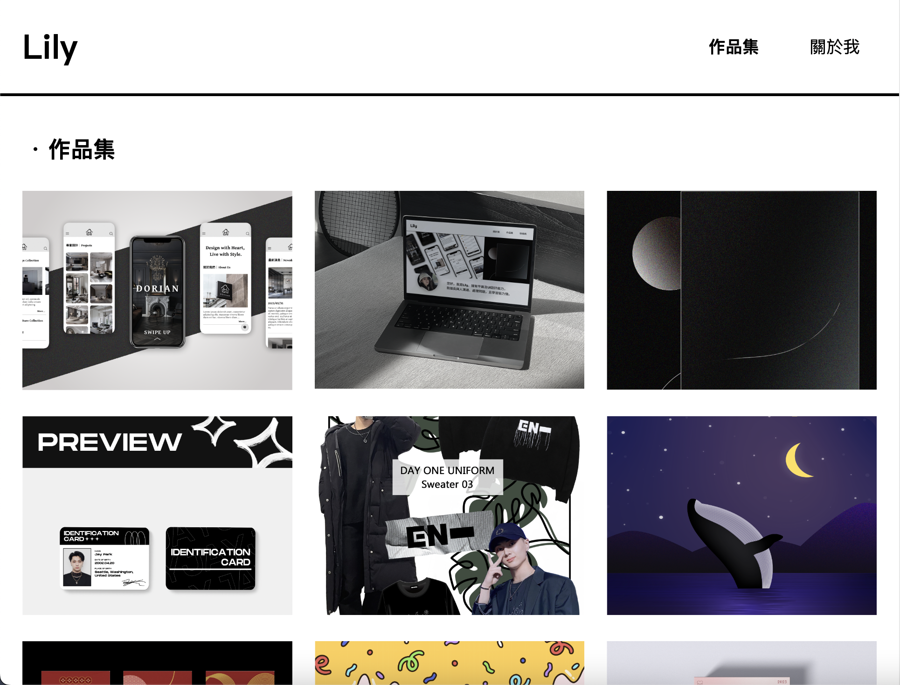
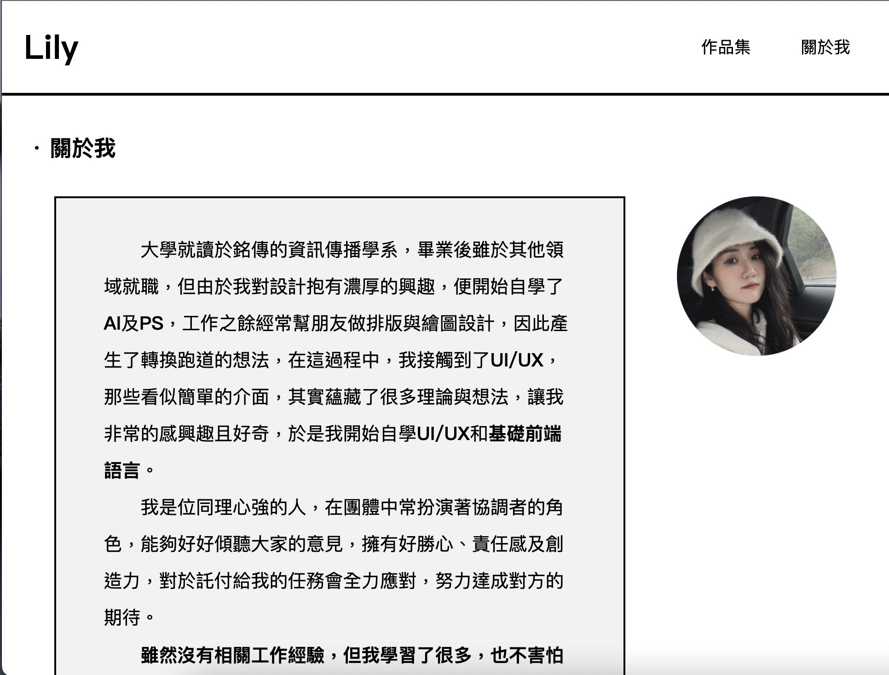
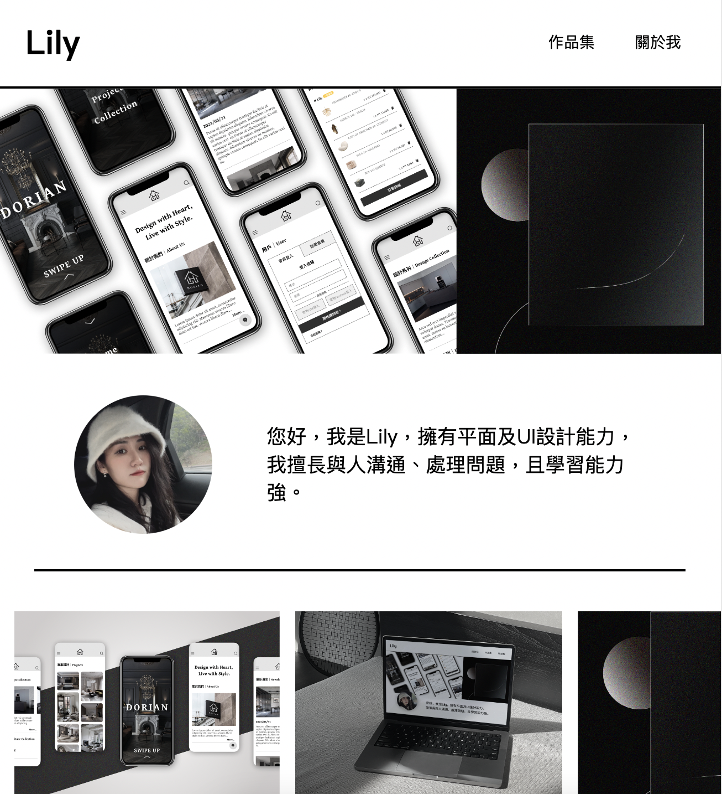
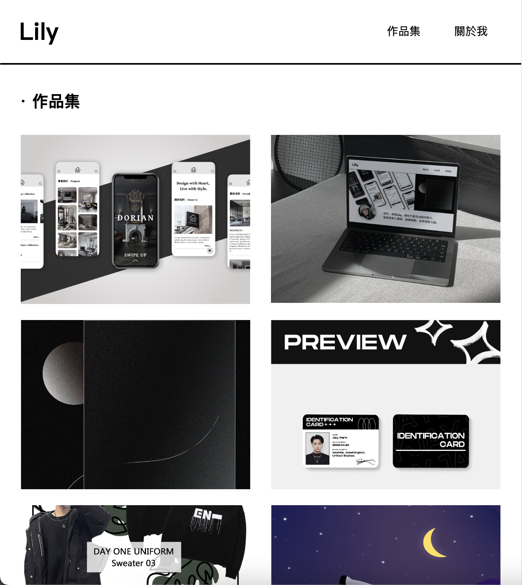
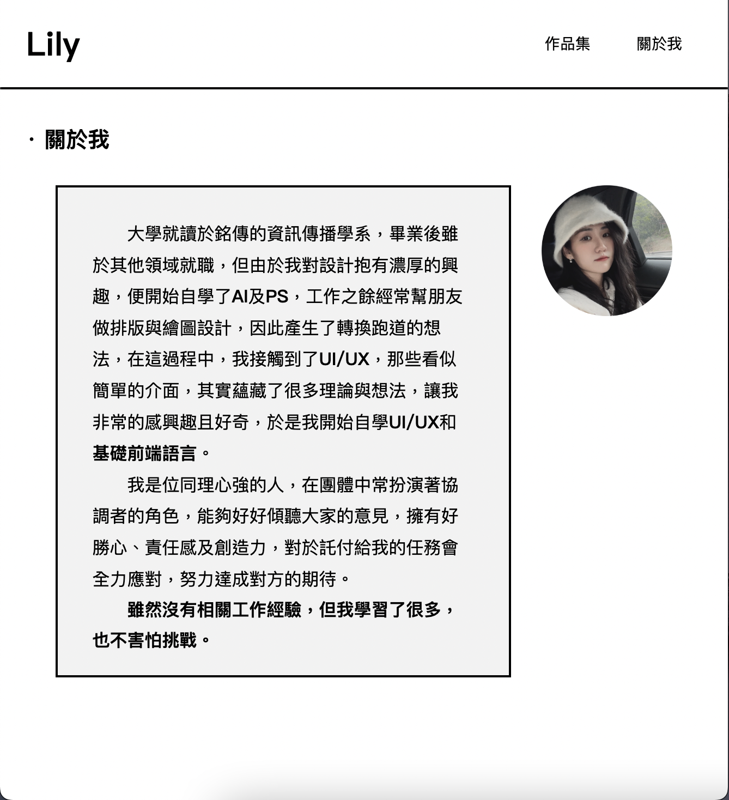
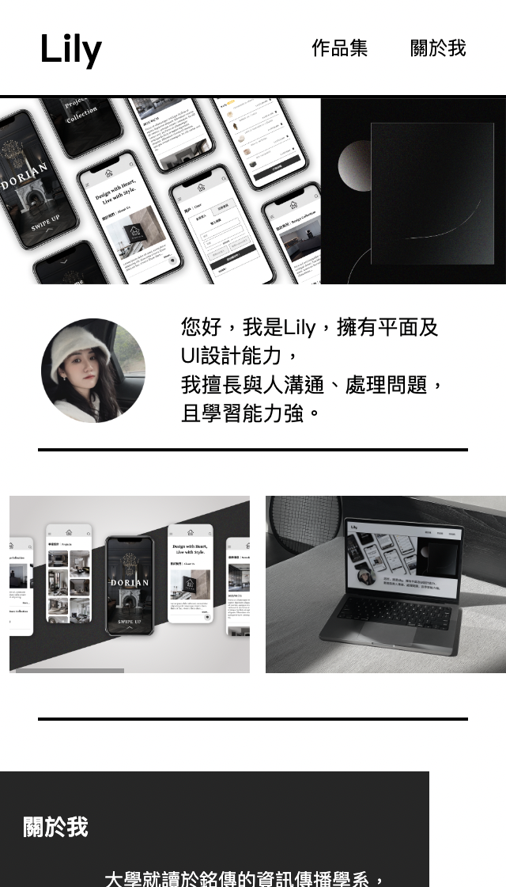
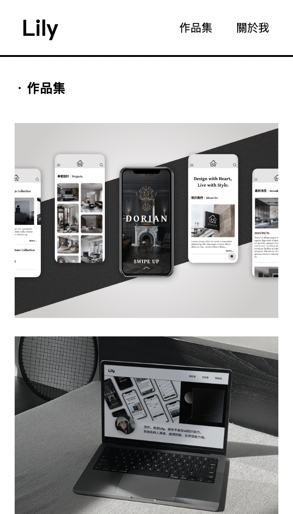
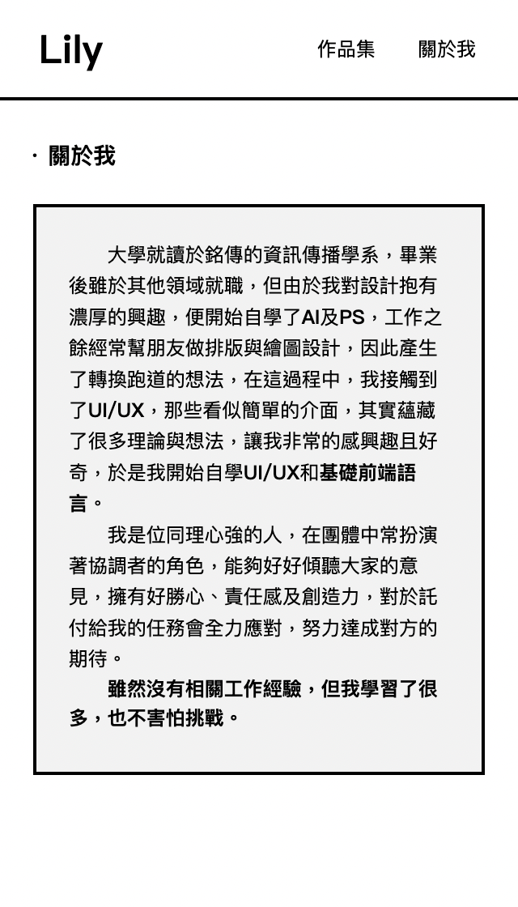

## Hi! I'm Lily,
This repository is used to store the code for my portfolio website and two additional pages,
and I have added comments to some of the code snippets to help you understand them better.  
These three websites all feature RWD, so feel free to give them a try.  
您好，我是Lily，  
這個專案是拿來存放我的網站之首頁、關於我及作品集的程式碼，我有加一些註解在一些程式碼上面，希望能幫助您更好理解。  
這三個頁面都是具有響應式設計的，歡迎您嘗試、體驗看看。  
- - -
  

- - -
&ensp;&emsp;&emsp;

- - -
&ensp;&emsp;&emsp;

- - -
&ensp;&emsp;&emsp;
